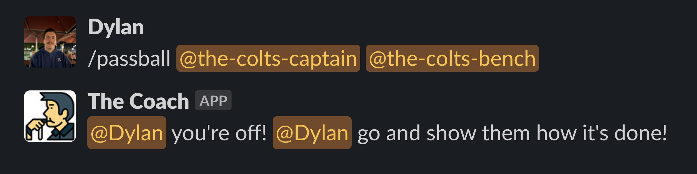

# The Coach

### Randomly reassign single member slack user groups with ease

---

## Usage

Create Slack app with the following scopes:
- `channels:read`
- `chat:write`
- `commands`
- `groups:read`
- `usergroups:read`
- `usergroups:write`

Copy Signing Secret and Bot User OAuth Token

Attach `PassBall` function to a router, passing `SLACK_SIGNING_SECRET`, and `SLACK_BOT_TOKEN` env vars.
Point Slack slash command to address, also make sure to tick the `Escape channels, users, and links sent to your app` box.

Optionally if using Cloud Functions you can use `deploy.go`, just update values to your project.
